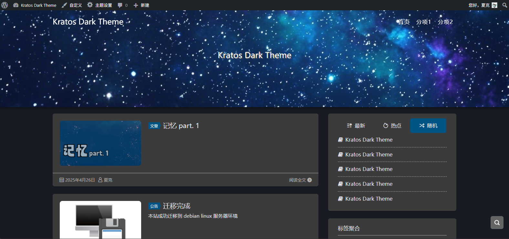
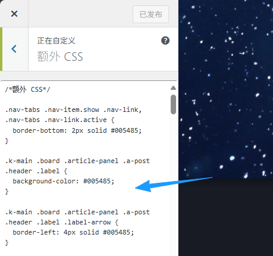

    

    

    <a href="https://github.com/seatonjiang/kratos/">Kratos</a>
    ·
    <a href="https://github.com/kc0ver/kratos-dark-theme/issues">Issues</a>

Kratos的深色主题

*只针对本人的网站制作，没有修改所有控件的样式

--------

使用方式

    

